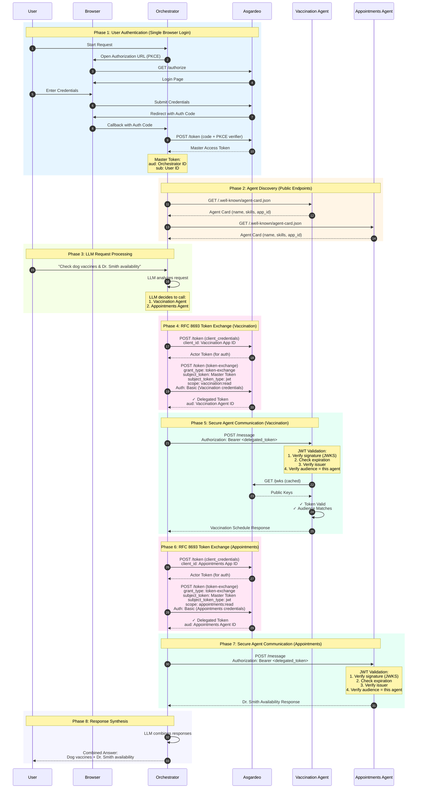

# Multi-Agent A2A Authentication Flow

## Overview

This document describes the secure authentication flow for the Multi-Agent A2A system using Asgardeo OAuth 2.0 Token Exchange (RFC 8693) with Trusted Token Issuer.

### Key Security Features

1. **Single Sign-On**: User authenticates once via browser
2. **Token Exchange**: Master token is exchanged for agent-specific tokens
3. **Audience Binding**: Each agent receives a token with its own client ID as audience
4. **No Browser Interrupts**: Agent communication happens without additional user interaction

## Sequence Diagram



## Token Flow Details

### Master Token (from browser auth)
```
{
  "aud": "6GcGVxi3GxDzmAFf756MwGzmuz8a",  // Orchestrator's client ID
  "sub": "67f171c3-e65a-4131-ab64-ebc0d7962504",  // User ID
  "iss": "https://api.asgardeo.io/t/pasansanjiiwa/oauth2/token"
}
```

### Delegated Token (after exchange for Vaccination Agent)
```
{
  "aud": "V5fehG024xohBqIuHzYWP7c59CEa",  // Vaccination Agent's client ID
  "sub": "67f171c3-e65a-4131-ab64-ebc0d7962504",  // Same User ID
  "iss": "https://api.asgardeo.io/t/pasansanjiiwa/oauth2/token"
}
```

### Delegated Token (after exchange for Appointments Agent)
```
{
  "aud": "GBuclOn0Oi68n8JF66f1Cq0WSrsa",  // Appointments Agent's client ID
  "sub": "67f171c3-e65a-4131-ab64-ebc0d7962504",  // Same User ID
  "iss": "https://api.asgardeo.io/t/pasansanjiiwa/oauth2/token"
}
```

## Security Guarantees

| Security Property | Implementation |
|------------------|----------------|
| User Identity | Preserved via `sub` claim in all tokens |
| Agent Authorization | Each token has unique `aud` matching agent's client ID |
| Token Integrity | Signature verified using Asgardeo JWKS |
| Token Freshness | Expiration (`exp`) checked on every request |
| Issuer Validation | Only tokens from Asgardeo org are accepted |

## Asgardeo Configuration

### Required Setup

1. **Trusted Token Issuer**: Configure your Asgardeo organization as a trusted token issuer for itself
2. **Applications**: Create separate applications for Orchestrator and each Agent
3. **API Resources**: Define scopes (`vaccination:read`, `appointments:read`)
4. **Scope Assignment**: Assign appropriate scopes to each application

### Token Exchange Request
```http
POST /oauth2/token HTTP/1.1
Host: api.asgardeo.io
Authorization: Basic <base64(agent_client_id:agent_client_secret)>
Content-Type: application/x-www-form-urlencoded

grant_type=urn:ietf:params:oauth:grant-type:token-exchange
&subject_token=<master_token>
&subject_token_type=urn:ietf:params:oauth:token-type:jwt
&requested_token_type=urn:ietf:params:oauth:token-type:access_token
&scope=vaccination:read
```

### Key Point
The `subject_token_type` must be `jwt` (not `access_token`) for Asgardeo's Trusted Token Issuer flow to work.
